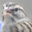

# 🧠 CIFAR-10 Image Classifier Using NumPy from Scratch

This repository contains a complete implementation of an image classification pipeline for the [CIFAR-10 dataset](https://www.cs.toronto.edu/~kriz/cifar.html), **built entirely with NumPy** — no deep learning libraries used. The model performs:

- 🧮 Convolution using custom vectorized operations
- 🧼 Max Pooling for spatial downsampling
- 📉 Flattening for dense layer input
- 🧠 Fully Connected 2-Layer Neural Network

---

## 📌 Key Features

- 🔧 **Manual 2D Convolution** using `np.lib.stride_tricks.as_strided`
- 📏 **Max Pooling** implementation (2×2)
- 🔁 **ReLU** and **Softmax** activations
- 🔄 **Forward + Backward Propagation**
- 🧠 2-Layer Dense Network: `2048 → 1024 → 10`
- 💾 Save/load model weights as `.npy` or `.npz`
- 🧪 Optional **Image Augmentation** (flip & rotation)
- 🧮 **Batch-wise Gradient Descent**
- 📊 Achieves ~75% accuracy without filter learning

---

## 🧪 Dataset - CIFAR-10

The [CIFAR-10 dataset](https://www.cs.toronto.edu/~kriz/cifar.html) is a collection of tiny color images labeled across 10 categories. It is widely used for benchmarking image classification algorithms.

- 🗂️ **Classes**: 10 (airplane, automobile, bird, cat, deer, dog, frog, horse, ship, truck)
- 🖼️ **Image Size**: `32 × 32 × 3` (RGB)
- 🏋️‍♂️ **Training Set**: 50,000 images
- 🧪 **Test Set**: 10,000 images

## 📷 Sample CIFAR-10 Images

  
  
  
  
  
  
  
  
  
  

